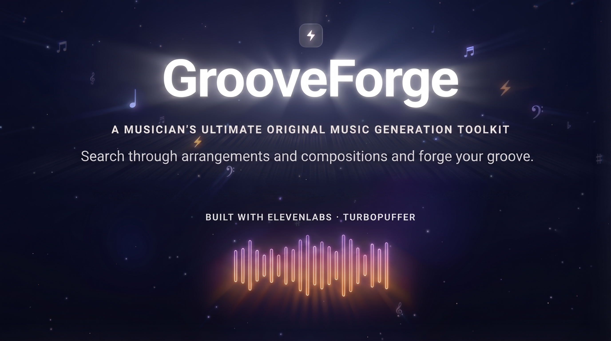
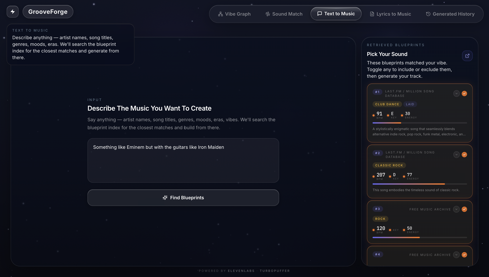
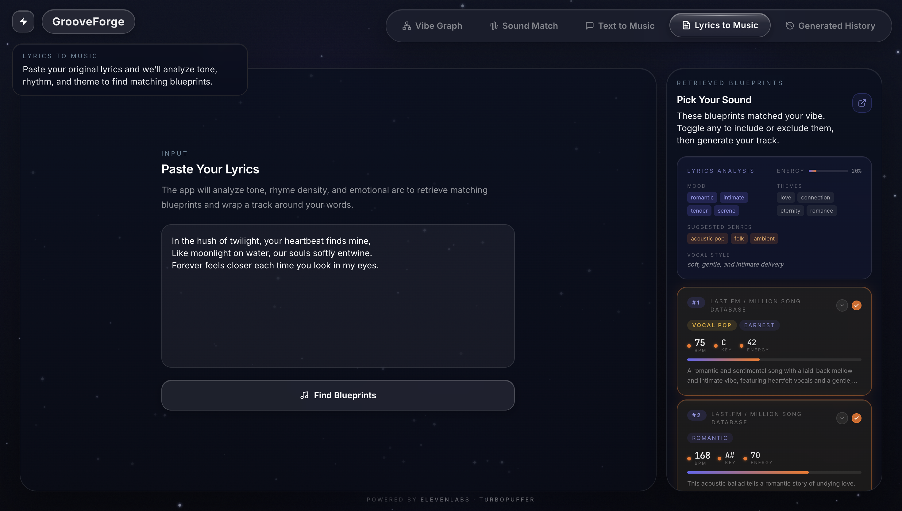
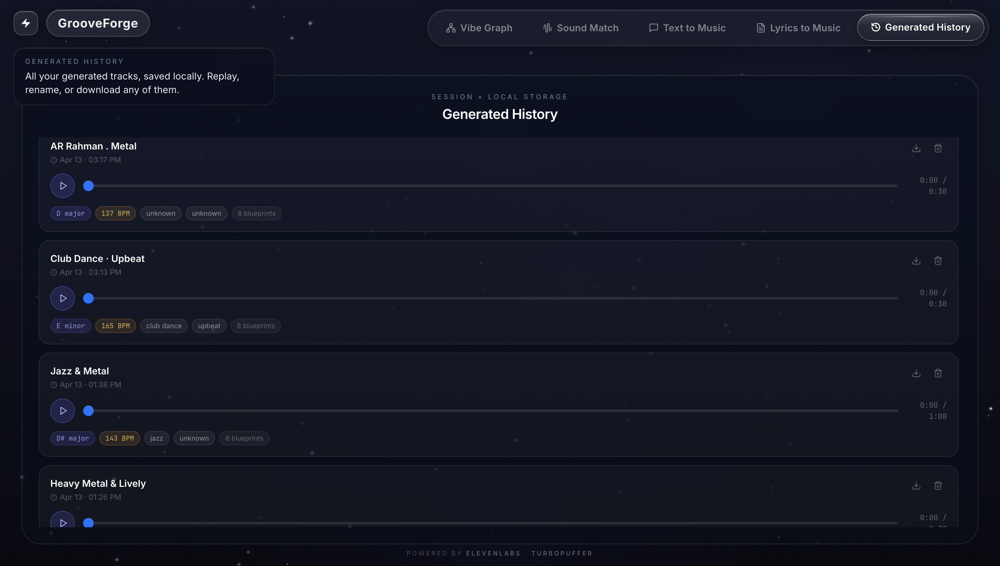
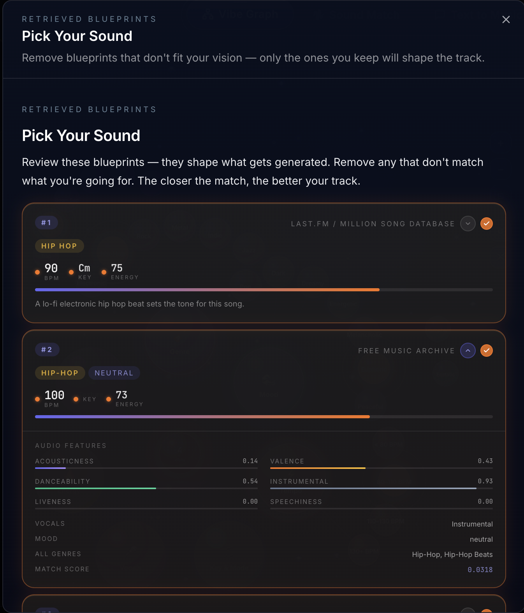
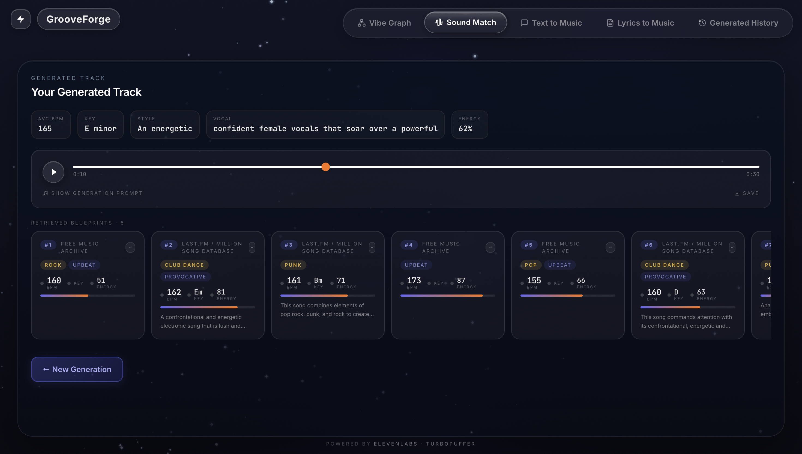
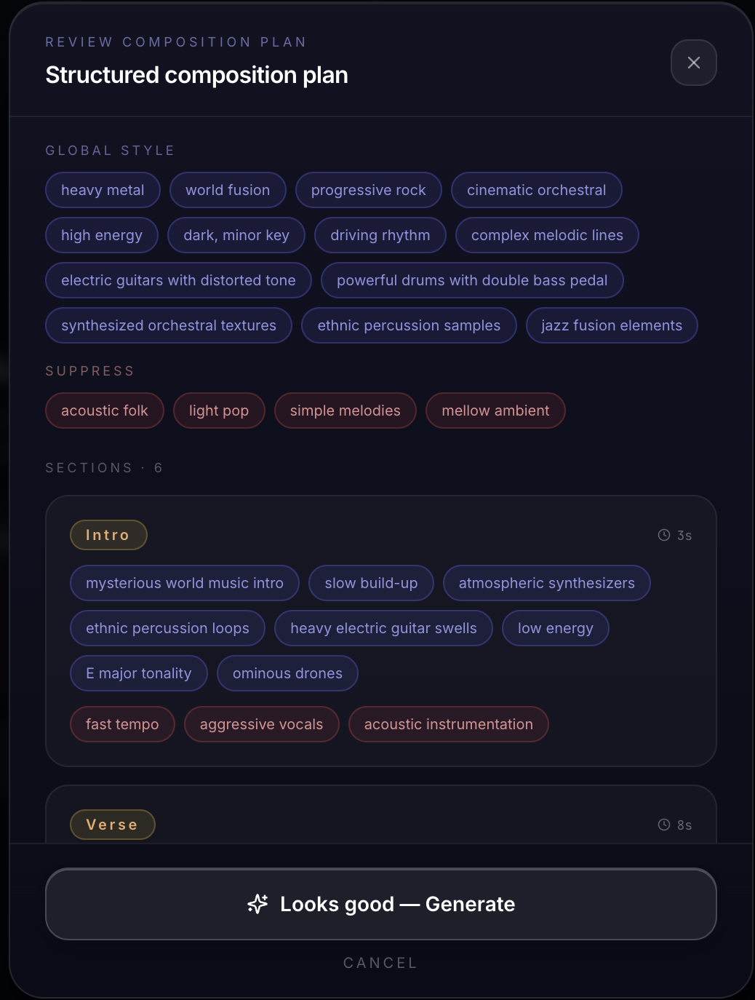
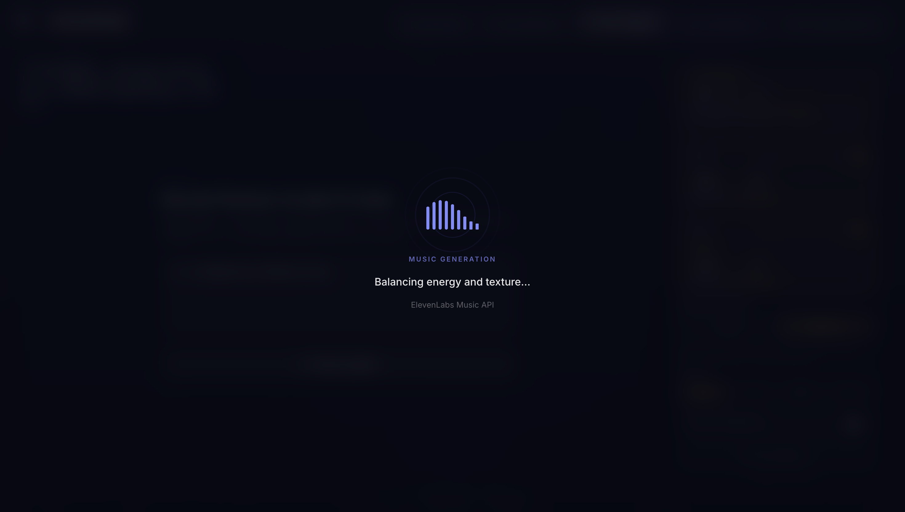

# GrooveForge

**Search by vibe. Generate by blueprint.**

[](https://groove-forge.vercel.app)
[](https://grooveforge-production.up.railway.app/health)
[](https://elevenlabs.io)
[](https://turbopuffer.com)
[](https://deepmind.google/technologies/gemini/)
[](https://elevenlabs.io)
[](https://react.dev)
[](https://fastapi.tiangolo.com)

> Music discovery is broken. Song titles tell you nothing about feel. Artist names lock you into what you already know. Playlists are curated by someone else's taste.
>
> GrooveForge starts where every other tool stops: with the **vibe itself**. Pick a mood, a genre, a tempo, a key — and get a completely original track built from the closest musical blueprints ever indexed.

<!-- Screenshot: Full app hero — replace with actual screenshot -->
<p align="center">
  
</p>

---

## Table of Contents

- [What is GrooveForge?](#what-is-grooveforge)
- [How It Works](#how-it-works)
- [Input Modes](#input-modes)
- [Architecture](#architecture)
- [Blueprint Schema](#blueprint-schema)
- [Generation Modes](#generation-modes)
- [Tech Stack](#tech-stack)
- [Screenshots](#screenshots)
- [Running Locally](#running-locally)
- [API Reference](#api-reference)
- [Demo Vibes](#demo-vibes)
- [Data & Legal](#data--legal)

---

## What is GrooveForge?

GrooveForge is a **retrieval-augmented music creation system**. Instead of describing music in the abstract, you search by the actual structural properties that make music sound the way it does — key, tempo, energy, mood, instrumentation, lyrical themes.

The backend retrieves the closest **musical blueprints** from a Turbopuffer vector index (620K+ tracks from LP-MusicCaps-MSD and FMA), aggregates their traits into a generation profile, and passes that grounded profile to ElevenLabs Music API to produce a fresh original track.

Every generated track comes with a visible **reasoning trail** — the exact blueprint cards that shaped it — so you can see *why* it sounds the way it does. No black boxes. No hallucinated characteristics.

---

## How It Works

**1. Pick a vibe** — Select nodes in the graph, type a description, paste lyrics, or record a sound clip.

**2. Retrieve blueprints** — Turbopuffer runs a hybrid ANN + BM25 search across 620K+ indexed tracks. The closest 5–10 musical blueprints surface with their metadata.

**3. Generate your track** — Blueprint traits are aggregated (avg BPM, dominant key/mode, genre cluster, mood cluster). Gemini synthesizes a grounded prompt or structured composition plan. ElevenLabs produces the audio.

---

## Input Modes

### Vibe Graph

Click genre, mood, tempo, key, mode, instrumentation, and theme nodes to compose a vibe. Every node selection tightens the search query. The system maps your picks to a hybrid retrieval query plus metadata filters, surfaces the closest blueprints, and generates.

<!-- Screenshot: Vibe Graph mode — replace with actual screenshot -->
<p align="center">
  
</p>

### Free-Text Search

Type anything: `"moody synthwave, 110 BPM, instrumental"` or `"upbeat pop, female vocals, summer road trip"`. Your description is embedded with `all-MiniLM-L6-v2` and searched with hybrid ANN + BM25 retrieval across both namespaces simultaneously.

<!-- Screenshot: Free-Text Search mode — replace with actual screenshot -->
<p align="center">
  
</p>

### Lyrics-to-Music

Paste original lyrics. Gemini analyzes emotional tone, themes, energy level, and rhythmic structure. The derived traits drive blueprint retrieval — your lyrics never contaminate the style guidance. In Advanced mode, lyrics are placed in ElevenLabs `lines` fields per section; style guidance comes from the blueprints only.

<!-- Screenshot: Lyrics-to-Music mode — replace with actual screenshot -->
<p align="center">
  
</p>

### Sound Match

Record a reference clip or upload an audio file. Gemini analyzes the audio for BPM, key, mood, texture, and instrumentation signals. Those derived traits drive blueprint retrieval — no audio file is ever stored or processed beyond the analysis step.

<!-- Screenshot: Sound Match mode — replace with actual screenshot -->
<p align="center">
  
</p>

### Generated History

Every track you generate is saved locally (localStorage). Replay any track, rename it, or download the MP3. History persists across sessions.

<!-- Screenshot: Generated History tab — replace with actual screenshot -->
<p align="center">
  
</p>

---

## Architecture

```
Browser (React 18 + TypeScript + Vite)
  ├─ ModeSwitcher: Graph | Text | Lyrics | Sound | History
  ├─ VibeGraph (react-flow): Genre / Mood / Key / Tempo / Instrumentation / Theme nodes
  ├─ InputPanels: free-text search, lyrics textarea, audio upload/record
  ├─ BlueprintDeck: toggle blueprints in/out, pop-out dialog, generation mode, track length
  ├─ GeneratingOverlay: two-phase animated loading (Blueprint Discovery → Music Generation)
  ├─ ReviewModal: preview prompt/plan before sending to ElevenLabs
  ├─ GenerationResult: audio player, aggregated traits, prompt inspector, reasoning trail
  ├─ LyricsAnalysisCard: mood/theme chips, energy bar, suggested genres, vocal style
  ├─ SoundAnalysisCard: BPM estimate, key, mood, texture tags
  ├─ HistoryPanel: localStorage-backed track list with player, rename, download
  └─ CompositionPlanView: global styles + per-section cards with lyrics preview

Backend (FastAPI)
  POST /api/search
    └── [concurrent] Turbopuffer hybrid retrieval (ANN + BM25 + metadata filters)
          → RRF merge across lp_msd_minilm + fma_minilm namespaces
          → Blueprint aggregation → { blueprints[], aggregated{} }

  POST /api/generate
    ├── [concurrent] Turbopuffer retrieval (both namespaces, asyncio.gather)
    ├── Gemini synthesis → simple text prompt or structured composition plan
    └── ElevenLabs Music API → audio file
          → { audio_url, prompt_used, composition_plan, blueprints[], aggregated{} }

  POST /api/preview
    └── Same as /api/generate but skips ElevenLabs — returns prompt/plan for review

  POST /api/analyze-lyrics
    ├── Gemini extracts: mood[], themes[], energy, suggested_genres[], vocal_style, search_query
    └── Turbopuffer retrieval on search_query → { analysis, blueprints[], aggregated{} }

  POST /api/analyze-sound
    ├── Gemini audio analysis: BPM, key, mood, texture, instrumentation
    └── Turbopuffer retrieval on derived traits → { analysis, blueprints[], aggregated{} }

  GET /api/health

Turbopuffer namespaces (active):
  lp_msd_minilm  — 513,977 records, 384-dim (all-MiniLM-L6-v2)
  fma_minilm     — 106,574 records, 384-dim (all-MiniLM-L6-v2)
  Both queried concurrently via asyncio.gather, merged with Reciprocal Rank Fusion (RRF)

LLM: Google Gemini 2.5-flash (google-genai SDK)
  synthesize_simple    → single text prompt grounded in blueprint traits
  synthesize_advanced  → structured composition plan (intro/verse/chorus/bridge/outro)
  analyze_lyrics       → mood / themes / energy / genres / vocal_style / search_query
  analyze_sound        → BPM / key / mood / texture / instrumentation from audio
```

---

## Blueprint Schema

Each indexed record is a **musical blueprint** — a structured metadata payload with a natural-language description as the retrieval anchor:

```json
{
  "id": "track_00123",
  "source_dataset": "LP-MusicCaps-MSD",
  "artist": "Example Artist",
  "genre": "synth-pop",
  "subgenre": "dream pop",
  "bpm": 118,
  "key": "C",
  "mode": "minor",
  "energy": 0.82,
  "acousticness": 0.11,
  "instrumentation": ["synth pads", "drum machine", "bass synth"],
  "themes": ["city", "night", "loneliness"],
  "vocal_type": "female vocals",
  "text_description": "A moody synth-pop track in C minor at 118 BPM with shimmering pads, pulsing bass, high energy, and lyrics about city lights and loneliness."
}
```

**Artist firewall:** Artist names and song titles from retrieved blueprints are **never** passed to Gemini or ElevenLabs. Only derived traits (genre, BPM, key, mood, instrumentation, energy) are used.

---

## Generation Modes

| Mode | Description |
|------|-------------|
| **Simple (Prompt)** | Fast iteration — one text prompt derived from aggregated blueprint traits sent to ElevenLabs |
| **Advanced (Composition Plan)** | Structured songs — section-level control (intro/verse/chorus/bridge/outro), lyric placement per section, local style guides |

Both modes support **Review Before Generate** — a dry-run that synthesizes and shows you the exact prompt or composition plan before committing to an ElevenLabs call. Approve or cancel.

Composition plan structure:
- `positive_global_styles` — genre, mood, tempo, key from aggregated blueprints
- `positive_local_styles` — per-section style directions
- `lines` — user lyrics only, placed per section (never mixed with style guidance)
- `negative_global_styles` — traits to suppress

---

## Tech Stack

| Category | Technology |
|----------|-----------|
| **Frontend** | React 18, TypeScript, Vite, TailwindCSS, Framer Motion, react-flow, Radix UI |
| **Backend** | FastAPI, Python 3.13+, `uv`, Pydantic, asyncio |
| **AI & Music** | ElevenLabs Music API (prompt + composition-plan), Google Gemini 2.5-flash |
| **Retrieval** | Turbopuffer — ANN + BM25 hybrid, metadata filters, RRF merge across 2 namespaces |
| **Embeddings** | `all-MiniLM-L6-v2` via OpenRouter API (384-dim, no local GPU needed) |
| **Data Sources** | LP-MusicCaps-MSD (513K), Free Music Archive (106K), MSD full (1M), MusicCaps (5.5K) |
| **Deployment** | Railway (backend, Hobby tier) + Vercel (frontend, SPA rewrite) |

---

## Screenshots

<!-- Screenshots: Blueprint cards + Generation result — replace with actual screenshots -->
<p align="center">
  
  
</p>

<!-- Screenshots: Review modal + Generating overlay — replace with actual screenshots -->
<p align="center">
  
  
</p>

---

## Running Locally

**Prerequisites:** Python 3.11+, Node 18+, [`uv`](https://docs.astral.sh/uv/)

```bash
# Backend
cd backend
uv sync
cp .env.example .env   # fill in API keys
uv run uvicorn app.main:app --reload --port 8000

# Frontend (separate terminal)
cd frontend
npm install
npm run dev
# Opens at http://localhost:8080
```

**Environment variables** (`backend/.env`):
```env
ELEVENLABS_API_KEY=...
TURBOPUFFER_API_KEY=...
OPENROUTER_API_KEY=...
GEMINI_API_KEY=...
```

**Data pipeline** (one-time setup — only needed to rebuild the Turbopuffer index):
```bash
cd backend
uv run python scripts/ingest_blueprints.py   # dataset → blueprint records
uv run python scripts/embed_blueprints.py    # embed + upsert into Turbopuffer
```

> The Turbopuffer namespaces (`lp_msd_minilm`, `fma_minilm`) are already populated in production. You only need to run the data pipeline if you're rebuilding the index from scratch.

---

## API Reference

```
POST /api/search
Body:
{
  "vibes": ["moody", "synthwave"],
  "free_text": "instrumental, city night",
  "bpm_lower": 100,
  "bpm_upper": 130,
  "key": "C minor",
  "vocal_type": "instrumental",
  "top_k": 8
}
Response:
{
  "blueprints": [...],
  "aggregated": {
    "avg_bpm": 118,
    "mode_key": "C minor",
    "genre_cluster": "synthwave",
    "mood_cluster": "moody",
    "energy": 0.75,
    "vocal_type": "instrumental"
  }
}

POST /api/generate
Body:
{
  "blueprints": [...],
  "vibes": ["moody", "synthwave"],
  "free_text": "",
  "lyrics": "",              // songwriter mode — goes into ElevenLabs lines only
  "user_input": "moody synthwave",
  "generation_mode": "simple",   // "simple" | "advanced"
  "music_length_ms": 90000
}
Response:
{
  "audio_url": "/static/audio/abc123.mp3",
  "prompt_used": "Moody synthwave instrumental, 118 BPM, C minor...",
  "composition_plan": null,      // populated in advanced mode
  "blueprints": [...],
  "aggregated": { "avg_bpm": 118, "mode_key": "C minor", ... }
}

POST /api/preview
// Same body as /api/generate — returns synthesized prompt/plan without calling ElevenLabs
Response: { "generation_mode": "simple", "prompt_used": "...", "composition_plan": null }

POST /api/analyze-lyrics
Body: { "lyrics": "In the city lights at 2am..." }
Response:
{
  "analysis": {
    "mood": ["melancholic", "atmospheric"],
    "themes": ["city", "night", "loneliness"],
    "energy": 0.45,
    "suggested_genres": ["synthwave", "dream pop"],
    "vocal_style": "breathy, introspective",
    "search_query": "melancholic atmospheric city night synthwave"
  },
  "blueprints": [...],
  "aggregated": { "avg_bpm": 112, "mode_key": "A minor", ... }
}

POST /api/analyze-sound
Body: multipart/form-data  { "file": <audio file> }
Response:
{
  "analysis": {
    "bpm": 118,
    "key": "C minor",
    "mood": ["dark", "driving"],
    "texture": ["synth pads", "drum machine"],
    "search_query": "dark driving C minor synthwave 118 BPM"
  },
  "blueprints": [...],
  "aggregated": { ... }
}

GET /api/health
Response: { "status": "ok" }
```

---

## Demo Vibes

| Vibe selection | Expected output |
|---------------|----------------|
| Moody · Synthwave · Instrumental · 110–130 BPM | Dark electronic, minor key, no vocals |
| Upbeat · Pop · Female vocals · 120 BPM · Summer themes | Bright, major key, catchy hook |
| Psychedelic · Indie · Guitar · 90–100 BPM | Hazy, reverb-heavy, mid-tempo |
| Melancholic · Piano · Ballad · Slow | Sparse, cinematic, emotional |
| High energy · Hip-hop · 140 BPM · Urban themes | Punchy, rhythmic, bass-forward |

---

## Data & Legal

**Sources:** Million Song Dataset, Free Music Archive (FMA), MusicCaps, LP-MusicCaps-MSD — metadata and derived features only.

**No audio files are processed, stored, or used.** Only structured features (BPM, key, genre, energy) and descriptive text (mood, themes, instrumentation captions) are indexed.

**Generated music** is original output from ElevenLabs Music API — not a copy or derivative of any indexed track. Artist names from retrieval results are never passed to the generator.
